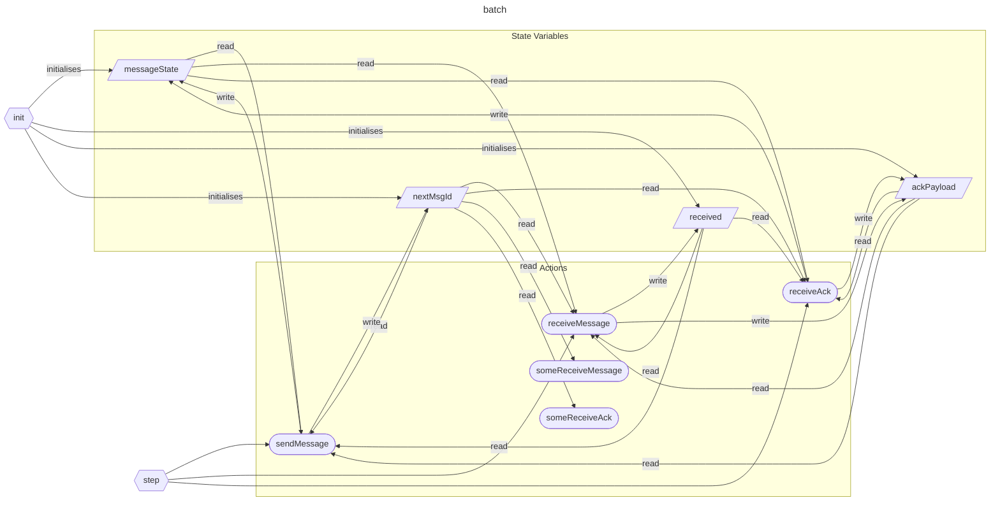

# State diagram




# Formal Verification Formulas

## Basic safety properties (invariants)

| Formula id                  | $$\text{two\_nodes\_only}$$                     |
| --------------------------- | ----------------------------------------------- |
| Type                        | invariant                                       |
| Logic family                | State predicate (safety), not CTL/LTL by itself |
| Formal verification formula | $$\|\mathit{NODES}\| = 2$$                      |
| Formal verification textual | The set NODES has size of 2.                    |
| Explanation                 | There are only two nodes in the batch protocol. |

| Formula id                  | $$\text{no\_self\_receiver\_state}$$                                           |
| --------------------------- | -------------------------------------------------------------------------- |
| Type                        | invariant                                                                  |
| Logic family                | State predicate (safety), not CTL/LTL by itself                            |
| Formal verification formula | $$\forall n \in \mathit{NODES} \,.\, \|\mathit{messageState}[n][n]\| = 0$$ |
| Formal verification textual | For every node n in NODES, the set messageState[n][n] is empty.            |
| Explanation                 |                                                                            |

| Formula id                  | $$\text{no\_self\_ack\_state}$$                                          |
| --------------------------- | ------------------------------------------------------------------------ |
| Type                        | invariant                                                                |
| Logic family                | State predicate (safety), not CTL/LTL by itself                         |
| Formal verification formula | $$\forall n \in \mathit{NODES} \,.\, \|\mathit{ackPayload}[n][n]\| = 0$$ |
| Formal verification textual | For every node n in NODES, the set ackPayload[n][n] is empty.          |
| Explanation                 |                                                                          |
## Message ID Bounds 
| Formula id                  | $$\text{message\_ids\_bounded}$$                                                                                                                                                    |
| --------------------------- | ----------------------------------------------------------------------------------------------------------------------------------------------------------------------------------- |
| Type                        | invariant                                                                                                                                                                           |
| Logic family                | State predicate (safety), not CTL/LTL by itself                                                                                                                                   |
| Formal verification formula | $$\forall \text{sender}, \text{receiver} \in \mathit{NODES} \,.\, \forall \text{id} \in \mathit{messageState}[\text{sender}][\text{receiver}] \,.\, 0 \leq \text{id} < \mathit{nextMsgId}$$ |
| Formal verification textual | For all sender and receiver in NODES, every id in messageState[sender][receiver] is non-negative and strictly smaller than nextMsgId.                                                    |
| Explanation                 |                                                                                                                                                                                     |


| Formula id                  | $$\text{ack\_ids\_bounded}$$                                                                                                                                                              |
| --------------------------- | ----------------------------------------------------------------------------------------------------------------------------------------------------------------------------------------- |
| Type                        | invariant                                                                                                                                                                                 |
| Logic family                | State predicate (safety), not CTL/LTL by itself                                                                                                                                         |
| Formal verification formula | $$\forall \text{receiver}, \text{sender} \in \mathit{NODES} \,.\, \forall \text{id} \in \mathit{ackPayload}[\text{receiver}][\text{sender}] \,.\, 0 \leq \text{id} < \mathit{nextMsgId}$$ |
| Formal verification textual | For all receiver and sender in NODES, every id in ackPayload[receiver][sender] is non-negative and strictly smaller than nextMsgId.                                                |
| Explanation                 |                                                                                                                                                                                           |


| Formula id                  | $$\text{received\_ids\_bounded}$$                                                                                                                         |
| --------------------------- | --------------------------------------------------------------------------------------------------------------------------------------------------------- |
| Type                        | invariant                                                                                                                                                 |
| Logic family                | State predicate (safety), not CTL/LTL by itself                                                                                                         |
| Formal verification formula | $$\forall \text{receiver} \in \mathit{NODES} \,.\, \forall \text{id} \in \mathit{received}[\text{receiver}] \,.\, 0 \leq \text{id} < \mathit{nextMsgId}$$ |
| Formal verification textual | For every receiver in NODES, each id in received[receiver] is non-negative and strictly smaller than nextMsgId.                                |
| Explanation                 |                                                                                                                                                           |


## Consistency Properties
| Formula id                  | $$\text{ack\_implies\_received}$$                                                                                                                                                                    |
| --------------------------- | ---------------------------------------------------------------------------------------------------------------------------------------------------------------------------------------------------- |
| Type                        | invariant                                                                                                                                                                                            |
| Logic family                | State predicate (safety), not CTL/LTL by itself                                                                                                                                                    |
| Formal verification formula | $$\forall \text{receiver}, \text{sender} \in \mathit{NODES} \,.\, \forall \text{id} \in \mathit{ackPayload}[\text{receiver}][\text{sender}] \,.\, \text{id} \in \mathit{received}[\text{receiver}]$$ |
| Formal verification textual | For all receiver and sender in NODES, every acknowledged id for receiver is also present in received[receiver].                                                                                 |
| Explanation                 |                                                                                                                                                                                                      |

| Formula id                  | $$\text{in\_flight\_never\_self}$$                                                                                                                                                                                             |
| --------------------------- | ------------------------------------------------------------------------------------------------------------------------------------------------------------------------------------------------------------------------------ |
| Type                        | invariant                                                                                                                                                                                                                      |
| Logic family                | State predicate (safety), not CTL/LTL by itself                                                                                                                                                                              |
| Formal verification formula | $$\forall \text{sender}, \text{receiver} \in \mathit{NODES} \,.\, \text{sender} \neq \text{receiver} \implies \mathit{messageState}[\text{sender}][\text{receiver}] \cap \mathit{messageState}[\text{sender}][\text{sender}] = \emptyset$$ |
| Formal verification textual | For every distinct sender and receiver, the in-flight messages to receiver do not overlap with sender's self-channel messages.                                                                            |
| Explanation                 |                                                                                                                                                                                                                                |


## Temporal and Liveness Properties
| Formula id                  | $$\text{received\_is\_monotonic}$$                                                                                      |
| --------------------------- | ----------------------------------------------------------------------------------------------------------------------- |
| Type                        | temporal                                                                                                                |
| Logic family                | LTL (first-order/quantified LTL)                                                                                        |
| Formal verification formula | $$\Box \left( \forall n \in \mathit{NODES} \,.\, \mathit{received}[n] \subseteq \bigcirc \mathit{received}[n] \right)$$ |
| Formal verification textual | For every node n in Nodes, the received set can only grow or stay the same in comparison with the next state.           |
| Explanation                 |                                                                                                                         |

| Formula id                  | $$\text{pending\_ack\_cleared}$$                                                                                                                                                                                                                     |
| --------------------------- | ---------------------------------------------------------------------------------------------------------------------------------------------------------------------------------------------------------------------------------------------------- |
| Type                        | temporal                                                                                                                                                                                                                                             |
| Logic family                | LTL (leads-to / response)                                                                                                                                                                                                                           |
| Formal verification formula | $$\forall \text{receiver}, \text{sender} \in \mathit{NODES} \,.\, \text{receiver} \neq \text{sender} \implies (\|\mathit{ackPayload}[\text{receiver}][\text{sender}]\| > 0) \leadsto (\|\mathit{ackPayload}[\text{receiver}][\text{sender}]\| = 0)$$ |
| Formal verification textual | For every distinct receiver and sender, if ackPayload[receiver][sender] is non-empty, it eventually becomes empty.                                                                                 |
| Explanation                 |                                                                                                                                                                                                                                                      |


| Formula id                  | $$\text{msg\_eventually\_acked}$$                                                                                                                                                                                                      |
| --------------------------- | -------------------------------------------------------------------------------------------------------------------------------------------------------------------------------------------------------------------------------------- |
| Type                        | temporal                                                                                                                                                                                                                               |
| Logic family                | LTL (leads-to / response)                                                                                                                                                                                                                |
| Formal verification formula | $$\forall \text{sender}, \text{receiver} \in \mathit{NODES} \,.\, \text{sender} \neq \text{receiver} \implies (\|\mathit{messageState}[\text{sender}][\text{receiver}]\| > 0) \leadsto (\|\mathit{ackPayload}[\text{receiver}][\text{sender}]\| > 0)$$ |
| Formal verification textual | For every distinct sender and receiver, if messageState[sender][receiver] is non-empty, then eventually ackPayload[receiver][sender] becomes non-empty.                                                      |
| Explanation                 |                                                                                                                                                                                                                                        |


## Fairness and Progress Under Fairness
| Formula id                  | $$\text{fair\_receive\_message}$$                                    |
| --------------------------- | -------------------------------------------------------------------- |
| Type                        | fairness assumption                                                  |
| Logic family                | Fairness constraint (WF), not CTL; temporal assumption              |
| Formal verification formula | $$\mathit{someReceiveMessage} \sim_{\text{weak}} \mathit{received}$$ |
| Formal verification textual | If someReceiveMessage stays enabled, weak fairness ensures it is taken often enough to keep delivery progressing. |
| Explanation                 |                                                                      |

| Formula id                  | $$\text{fair\_receive\_ack}$$                                        |
| --------------------------- | -------------------------------------------------------------------- |
| Type                        | fairness assumption                                                  |
| Logic family                | Fairness constraint (WF), not CTL; temporal assumption              |
| Formal verification formula | $$\mathit{someReceiveAck} \sim_{\text{weak}} \mathit{messageState}$$ |
| Formal verification textual | If someReceiveAck stays enabled, weak fairness ensures it is taken often enough to keep cleanup progressing. |
| Explanation                 |                                                                      |

| Formula id                  | $$\text{cleanup\_under\_fairness}$$                                                                                                                                                                                                                                                                               |
| --------------------------- | ----------------------------------------------------------------------------------------------------------------------------------------------------------------------------------------------------------------------------------------------------------------------------------------------------------------- |
| Type                        | temporal (under fairness assumptions)                                                                                                                                                                                                                                                                               |
| Logic family                | LTL under fairness assumptions                                                                                                                                                                                                                                                                                      |
| Formal verification formula | $$(\text{fair\_receive\_message} \land \text{fair\_receive\_ack}) \implies \forall \text{sender}, \text{receiver} \in \mathit{NODES} \,.\, \text{sender} \neq \text{receiver} \implies (\|\mathit{messageState}[\text{sender}][\text{receiver}]\| > 0) \leadsto (\|\mathit{messageState}[\text{sender}][\text{receiver}]\| = 0)$$ |
| Formal verification textual | Under both weak fairness assumptions, every non-empty in-flight message set between distinct nodes is eventually emptied.                                                                                                                                      |
| Explanation                 |                                                                                                                                                                                                                                                                                                                   |


## Witness Properties (Existence Assertions)
| Formula id                  | $$\text{can\_have\_in\_flight}$$                                                                                                                               |
| --------------------------- | -------------------------------------------------------------------------------------------------------------------------------------------------------------- |
| Type                        | witness (existential state property)                                                                                                                         |
| Logic family                | State predicate (existential witness), not CTL/LTL                                                                                                          |
| Formal verification formula | $$\exists \text{sender}, \text{receiver} \in \mathit{NODES} \,.\, \text{sender} \neq \text{receiver} \land \|\mathit{messageState}[\text{sender}][\text{receiver}]\| > 0$$ |
| Formal verification textual | There exist two distinct nodes for which at least one message can be in flight.                                   |
| Explanation                 |                                                                                                                                                                |


| Formula id                  | $$\text{can\_have\_pending\_acks}$$                                                                                                                                      |
| --------------------------- | ------------------------------------------------------------------------------------------------------------------------------------------------------------------------ |
| Type                        | witness (existential state property)                                                                                                                                      |
| Logic family                | State predicate (existential witness), not CTL/LTL                                                                                                                        |
| Formal verification formula | $$\exists \text{receiver}, \text{sender} \in \mathit{NODES} \,.\, \text{receiver} \neq \text{sender} \land \|\mathit{ackPayload}[\text{receiver}][\text{sender}]\| > 0$$ |
| Formal verification textual | There exist two distinct nodes for which at least one pending acknowledgment can exist.                                                                       |
| Explanation                 |                                                                                                                                                                          |


| Formula id                  | $$\text{can\_have\_delivered}$$                                                                 |
| --------------------------- | ----------------------------------------------------------------------------------------------- |
| Type                        | witness (existential state property)                                                           |
| Logic family                | State predicate (existential witness), not CTL/LTL                                             |
| Formal verification formula | $$\exists \text{receiver} \in \mathit{NODES} \,.\, \|\mathit{received}[\text{receiver}]\| > 0$$ |
| Formal verification textual | There exists a receiver in the set of NODES, that has received at least 1 message.              |
| Explanation                 | This means that the protocol can deliver messages in batch mode.                                |


# Example command executions

## Execution 1

| Command    | `quint run versions/01/batch/batch.qnt --mbt` |
| ---------- | --------------------------------------------- |
| violations | 0                                             |
### Result
```powershell
An example execution:

[State 0]
{
  ackPayload: Map("A" -> Map("A" -> Set(), "B" -> Set()), "B" -> Map("A" -> Set(), "B" -> Set())),
  mbt::actionTaken: "init",
  mbt::nondetPicks: { msgId: None, receiver: None, sender: None },
  messageState: Map("A" -> Map("A" -> Set(), "B" -> Set()), "B" -> Map("A" -> Set(), "B" -> Set())),
  nextMsgId: 0,
  received: Map("A" -> Set(), "B" -> Set())
}

[State 1]
{
  ackPayload: Map("A" -> Map("A" -> Set(), "B" -> Set()), "B" -> Map("A" -> Set(), "B" -> Set())),
  mbt::actionTaken: "sendMessage",
  mbt::nondetPicks: { msgId: Some(0), receiver: Some("A"), sender: Some("B") },
  messageState: Map("A" -> Map("A" -> Set(), "B" -> Set()), "B" -> Map("A" -> Set(0), "B" -> Set())),
  nextMsgId: 1,
  received: Map("A" -> Set(), "B" -> Set())
}

[State 2]
{
  ackPayload: Map("A" -> Map("A" -> Set(), "B" -> Set()), "B" -> Map("A" -> Set(), "B" -> Set())),
  mbt::actionTaken: "sendMessage",
  mbt::nondetPicks: { msgId: Some(0), receiver: Some("B"), sender: Some("A") },
  messageState: Map("A" -> Map("A" -> Set(), "B" -> Set(1)), "B" -> Map("A" -> Set(0), "B" -> Set())),
  nextMsgId: 2,
  received: Map("A" -> Set(), "B" -> Set())
}

[State 3]
{
  ackPayload: Map("A" -> Map("A" -> Set(), "B" -> Set()), "B" -> Map("A" -> Set(), "B" -> Set())),
  mbt::actionTaken: "sendMessage",
  mbt::nondetPicks: { msgId: Some(0), receiver: Some("B"), sender: Some("A") },
  messageState: Map("A" -> Map("A" -> Set(), "B" -> Set(1, 2)), "B" -> Map("A" -> Set(0), "B" -> Set())),
  nextMsgId: 3,
  received: Map("A" -> Set(), "B" -> Set())
}

[State 4]
{
  ackPayload: Map("A" -> Map("A" -> Set(), "B" -> Set()), "B" -> Map("A" -> Set(), "B" -> Set())),
  mbt::actionTaken: "sendMessage",
  mbt::nondetPicks: { msgId: Some(2), receiver: Some("B"), sender: Some("A") },
  messageState: Map("A" -> Map("A" -> Set(), "B" -> Set(1, 2, 3)), "B" -> Map("A" -> Set(0), "B" -> Set())),
  nextMsgId: 4,
  received: Map("A" -> Set(), "B" -> Set())
}

[State 5]
{
  ackPayload: Map("A" -> Map("A" -> Set(), "B" -> Set()), "B" -> Map("A" -> Set(), "B" -> Set())),
  mbt::actionTaken: "sendMessage",
  mbt::nondetPicks: { msgId: Some(0), receiver: Some("A"), sender: Some("B") },
  messageState: Map("A" -> Map("A" -> Set(), "B" -> Set(1, 2, 3)), "B" -> Map("A" -> Set(0, 4), "B" -> Set())),
  nextMsgId: 5,
  received: Map("A" -> Set(), "B" -> Set())
}

[State 6]
{
  ackPayload: Map("A" -> Map("A" -> Set(), "B" -> Set()), "B" -> Map("A" -> Set(), "B" -> Set())),
  mbt::actionTaken: "sendMessage",
  mbt::nondetPicks: { msgId: Some(2), receiver: Some("A"), sender: Some("B") },
  messageState: Map("A" -> Map("A" -> Set(), "B" -> Set(1, 2, 3)), "B" -> Map("A" -> Set(0, 4, 5), "B" -> Set())),
  nextMsgId: 6,
  received: Map("A" -> Set(), "B" -> Set())
}

[State 7]
{
  ackPayload: Map("A" -> Map("A" -> Set(), "B" -> Set()), "B" -> Map("A" -> Set(), "B" -> Set())),
  mbt::actionTaken: "sendMessage",
  mbt::nondetPicks: { msgId: Some(5), receiver: Some("B"), sender: Some("A") },
  messageState: Map("A" -> Map("A" -> Set(), "B" -> Set(1, 2, 3, 6)), "B" -> Map("A" -> Set(0, 4, 5), "B" -> Set())),
  nextMsgId: 7,
  received: Map("A" -> Set(), "B" -> Set())
}

[State 8]
{
  ackPayload: Map("A" -> Map("A" -> Set(), "B" -> Set()), "B" -> Map("A" -> Set(), "B" -> Set())),
  mbt::actionTaken: "sendMessage",
  mbt::nondetPicks: { msgId: Some(6), receiver: Some("B"), sender: Some("A") },
  messageState: Map("A" -> Map("A" -> Set(), "B" -> Set(1, 2, 3, 6, 7)), "B" -> Map("A" -> Set(0, 4, 5), "B" -> Set())),
  nextMsgId: 8,
  received: Map("A" -> Set(), "B" -> Set())
}

[State 9]
{
  ackPayload: Map("A" -> Map("A" -> Set(), "B" -> Set(4)), "B" -> Map("A" -> Set(), "B" -> Set())),
  mbt::actionTaken: "receiveMessage",
  mbt::nondetPicks: { msgId: Some(4), receiver: Some("A"), sender: Some("B") },
  messageState: Map("A" -> Map("A" -> Set(), "B" -> Set(1, 2, 3, 6, 7)), "B" -> Map("A" -> Set(0, 4, 5), "B" -> Set())),
  nextMsgId: 8,
  received: Map("A" -> Set(4), "B" -> Set())
}

[State 10]
{
  ackPayload: Map("A" -> Map("A" -> Set(), "B" -> Set(4)), "B" -> Map("A" -> Set(), "B" -> Set())),
  mbt::actionTaken: "sendMessage",
  mbt::nondetPicks: { msgId: Some(0), receiver: Some("A"), sender: Some("B") },
  messageState: Map("A" -> Map("A" -> Set(), "B" -> Set(1, 2, 3, 6, 7)), "B" -> Map("A" -> Set(0, 4, 5, 8), "B" -> Set())),
  nextMsgId: 9,
  received: Map("A" -> Set(4), "B" -> Set())
}

[State 11]
{
  ackPayload: Map("A" -> Map("A" -> Set(), "B" -> Set(4)), "B" -> Map("A" -> Set(), "B" -> Set())),
  mbt::actionTaken: "sendMessage",
  mbt::nondetPicks: { msgId: Some(6), receiver: Some("A"), sender: Some("B") },
  messageState: Map("A" -> Map("A" -> Set(), "B" -> Set(1, 2, 3, 6, 7)), "B" -> Map("A" -> Set(0, 4, 5, 8, 9), "B" -> Set())),
  nextMsgId: 10,
  received: Map("A" -> Set(4), "B" -> Set())
}

[State 12]
{
  ackPayload: Map("A" -> Map("A" -> Set(), "B" -> Set(4)), "B" -> Map("A" -> Set(), "B" -> Set())),
  mbt::actionTaken: "sendMessage",
  mbt::nondetPicks: { msgId: Some(1), receiver: Some("B"), sender: Some("A") },
  messageState: Map("A" -> Map("A" -> Set(), "B" -> Set(1, 2, 3, 6, 7, 10)), "B" -> Map("A" -> Set(0, 4, 5, 8, 9), "B" -> Set())),
  nextMsgId: 11,
  received: Map("A" -> Set(4), "B" -> Set())
}

[State 13]
{
  ackPayload: Map("A" -> Map("A" -> Set(), "B" -> Set(4)), "B" -> Map("A" -> Set(), "B" -> Set())),
  mbt::actionTaken: "sendMessage",
  mbt::nondetPicks: { msgId: Some(2), receiver: Some("B"), sender: Some("A") },
  messageState: Map("A" -> Map("A" -> Set(), "B" -> Set(1, 2, 3, 6, 7, 10, 11)), "B" -> Map("A" -> Set(0, 4, 5, 8, 9), "B" -> Set())),
  nextMsgId: 12,
  received: Map("A" -> Set(4), "B" -> Set())
}

[State 14]
{
  ackPayload: Map("A" -> Map("A" -> Set(), "B" -> Set(4)), "B" -> Map("A" -> Set(10), "B" -> Set())),
  mbt::actionTaken: "receiveMessage",
  mbt::nondetPicks: { msgId: Some(10), receiver: Some("B"), sender: Some("A") },
  messageState: Map("A" -> Map("A" -> Set(), "B" -> Set(1, 2, 3, 6, 7, 10, 11)), "B" -> Map("A" -> Set(0, 4, 5, 8, 9), "B" -> Set())),
  nextMsgId: 12,
  received: Map("A" -> Set(4), "B" -> Set(10))
}

[State 15]
{
  ackPayload: Map("A" -> Map("A" -> Set(), "B" -> Set(4, 5)), "B" -> Map("A" -> Set(10), "B" -> Set())),
  mbt::actionTaken: "receiveMessage",
  mbt::nondetPicks: { msgId: Some(5), receiver: Some("A"), sender: Some("B") },
  messageState: Map("A" -> Map("A" -> Set(), "B" -> Set(1, 2, 3, 6, 7, 10, 11)), "B" -> Map("A" -> Set(0, 4, 5, 8, 9), "B" -> Set())),
  nextMsgId: 12,
  received: Map("A" -> Set(4, 5), "B" -> Set(10))
}

[State 16]
{
  ackPayload: Map("A" -> Map("A" -> Set(), "B" -> Set(4, 5)), "B" -> Map("A" -> Set(10), "B" -> Set())),
  mbt::actionTaken: "sendMessage",
  mbt::nondetPicks: { msgId: Some(6), receiver: Some("A"), sender: Some("B") },
  messageState: Map("A" -> Map("A" -> Set(), "B" -> Set(1, 2, 3, 6, 7, 10, 11)), "B" -> Map("A" -> Set(0, 4, 5, 8, 9, 12), "B" -> Set())),
  nextMsgId: 13,
  received: Map("A" -> Set(4, 5), "B" -> Set(10))
}

[State 17]
{
  ackPayload: Map("A" -> Map("A" -> Set(), "B" -> Set(5)), "B" -> Map("A" -> Set(10), "B" -> Set())),
  mbt::actionTaken: "receiveAck",
  mbt::nondetPicks: { msgId: Some(4), receiver: Some("A"), sender: Some("B") },
  messageState: Map("A" -> Map("A" -> Set(), "B" -> Set(1, 2, 3, 6, 7, 10, 11)), "B" -> Map("A" -> Set(0, 5, 8, 9, 12), "B" -> Set())),
  nextMsgId: 13,
  received: Map("A" -> Set(4, 5), "B" -> Set(10))
}

[State 18]
{
  ackPayload: Map("A" -> Map("A" -> Set(), "B" -> Set(5)), "B" -> Map("A" -> Set(10), "B" -> Set())),
  mbt::actionTaken: "sendMessage",
  mbt::nondetPicks: { msgId: Some(3), receiver: Some("A"), sender: Some("B") },
  messageState: Map("A" -> Map("A" -> Set(), "B" -> Set(1, 2, 3, 6, 7, 10, 11)), "B" -> Map("A" -> Set(0, 5, 8, 9, 12, 13), "B" -> Set())),
  nextMsgId: 14,
  received: Map("A" -> Set(4, 5), "B" -> Set(10))
}

[State 19]
{
  ackPayload: Map("A" -> Map("A" -> Set(), "B" -> Set(5)), "B" -> Map("A" -> Set(10), "B" -> Set())),
  mbt::actionTaken: "sendMessage",
  mbt::nondetPicks: { msgId: Some(11), receiver: Some("A"), sender: Some("B") },
  messageState: Map("A" -> Map("A" -> Set(), "B" -> Set(1, 2, 3, 6, 7, 10, 11)), "B" -> Map("A" -> Set(0, 5, 8, 9, 12, 13, 14), "B" -> Set())),
  nextMsgId: 15,
  received: Map("A" -> Set(4, 5), "B" -> Set(10))
}

[State 20]
{
  ackPayload: Map("A" -> Map("A" -> Set(), "B" -> Set(5, 14)), "B" -> Map("A" -> Set(10), "B" -> Set())),
  mbt::actionTaken: "receiveMessage",
  mbt::nondetPicks: { msgId: Some(14), receiver: Some("A"), sender: Some("B") },
  messageState: Map("A" -> Map("A" -> Set(), "B" -> Set(1, 2, 3, 6, 7, 10, 11)), "B" -> Map("A" -> Set(0, 5, 8, 9, 12, 13, 14), "B" -> Set())),
  nextMsgId: 15,
  received: Map("A" -> Set(4, 5, 14), "B" -> Set(10))
}

[ok] No violation found (295ms at 33898 traces/second).
Trace length statistics: max=21, min=21, average=21.00
You may increase --max-samples and --max-steps.
Use --verbosity to produce more (or less) output.
Use --seed=0xf312c0885e37e957 --backend=rust to reproduce.
```

### MBT trace matrices

| State | Action | $M$ (messageState) | $K$ (ackPayload) | $R$ (received) |
| ----- | ------ | ------------------ | ---------------- | -------------- |
| 0 | init | $\begin{bmatrix}\varnothing&\varnothing\\\varnothing&\varnothing\end{bmatrix}$ | $\begin{bmatrix}\varnothing&\varnothing\\\varnothing&\varnothing\end{bmatrix}$ | $\begin{bmatrix}\varnothing\\\varnothing\end{bmatrix}$ |
| 1 | sendMessage | $\begin{bmatrix}\varnothing&\varnothing\\\{0\}&\varnothing\end{bmatrix}$ | $\begin{bmatrix}\varnothing&\varnothing\\\varnothing&\varnothing\end{bmatrix}$ | $\begin{bmatrix}\varnothing\\\varnothing\end{bmatrix}$ |
| 2 | sendMessage | $\begin{bmatrix}\varnothing&\{1\}\\\{0\}&\varnothing\end{bmatrix}$ | $\begin{bmatrix}\varnothing&\varnothing\\\varnothing&\varnothing\end{bmatrix}$ | $\begin{bmatrix}\varnothing\\\varnothing\end{bmatrix}$ |
| 3 | sendMessage | $\begin{bmatrix}\varnothing&\{1,2\}\\\{0\}&\varnothing\end{bmatrix}$ | $\begin{bmatrix}\varnothing&\varnothing\\\varnothing&\varnothing\end{bmatrix}$ | $\begin{bmatrix}\varnothing\\\varnothing\end{bmatrix}$ |
| 4 | sendMessage | $\begin{bmatrix}\varnothing&\{1,2,3\}\\\{0\}&\varnothing\end{bmatrix}$ | $\begin{bmatrix}\varnothing&\varnothing\\\varnothing&\varnothing\end{bmatrix}$ | $\begin{bmatrix}\varnothing\\\varnothing\end{bmatrix}$ |
| 5 | sendMessage | $\begin{bmatrix}\varnothing&\{1,2,3\}\\\{0,4\}&\varnothing\end{bmatrix}$ | $\begin{bmatrix}\varnothing&\varnothing\\\varnothing&\varnothing\end{bmatrix}$ | $\begin{bmatrix}\varnothing\\\varnothing\end{bmatrix}$ |
| 6 | sendMessage | $\begin{bmatrix}\varnothing&\{1,2,3\}\\\{0,4,5\}&\varnothing\end{bmatrix}$ | $\begin{bmatrix}\varnothing&\varnothing\\\varnothing&\varnothing\end{bmatrix}$ | $\begin{bmatrix}\varnothing\\\varnothing\end{bmatrix}$ |
| 7 | sendMessage | $\begin{bmatrix}\varnothing&\{1,2,3,6\}\\\{0,4,5\}&\varnothing\end{bmatrix}$ | $\begin{bmatrix}\varnothing&\varnothing\\\varnothing&\varnothing\end{bmatrix}$ | $\begin{bmatrix}\varnothing\\\varnothing\end{bmatrix}$ |
| 8 | sendMessage | $\begin{bmatrix}\varnothing&\{1,2,3,6,7\}\\\{0,4,5\}&\varnothing\end{bmatrix}$ | $\begin{bmatrix}\varnothing&\varnothing\\\varnothing&\varnothing\end{bmatrix}$ | $\begin{bmatrix}\varnothing\\\varnothing\end{bmatrix}$ |
| 9 | receiveMessage | $\begin{bmatrix}\varnothing&\{1,2,3,6,7\}\\\{0,4,5\}&\varnothing\end{bmatrix}$ | $\begin{bmatrix}\varnothing&\{4\}\\\varnothing&\varnothing\end{bmatrix}$ | $\begin{bmatrix}\{4\}\\\varnothing\end{bmatrix}$ |
| 10 | sendMessage | $\begin{bmatrix}\varnothing&\{1,2,3,6,7\}\\\{0,4,5,8\}&\varnothing\end{bmatrix}$ | $\begin{bmatrix}\varnothing&\{4\}\\\varnothing&\varnothing\end{bmatrix}$ | $\begin{bmatrix}\{4\}\\\varnothing\end{bmatrix}$ |
| 11 | sendMessage | $\begin{bmatrix}\varnothing&\{1,2,3,6,7\}\\\{0,4,5,8,9\}&\varnothing\end{bmatrix}$ | $\begin{bmatrix}\varnothing&\{4\}\\\varnothing&\varnothing\end{bmatrix}$ | $\begin{bmatrix}\{4\}\\\varnothing\end{bmatrix}$ |
| 12 | sendMessage | $\begin{bmatrix}\varnothing&\{1,2,3,6,7,10\}\\\{0,4,5,8,9\}&\varnothing\end{bmatrix}$ | $\begin{bmatrix}\varnothing&\{4\}\\\varnothing&\varnothing\end{bmatrix}$ | $\begin{bmatrix}\{4\}\\\varnothing\end{bmatrix}$ |
| 13 | sendMessage | $\begin{bmatrix}\varnothing&\{1,2,3,6,7,10,11\}\\\{0,4,5,8,9\}&\varnothing\end{bmatrix}$ | $\begin{bmatrix}\varnothing&\{4\}\\\varnothing&\varnothing\end{bmatrix}$ | $\begin{bmatrix}\{4\}\\\varnothing\end{bmatrix}$ |
| 14 | receiveMessage | $\begin{bmatrix}\varnothing&\{1,2,3,6,7,10,11\}\\\{0,4,5,8,9\}&\varnothing\end{bmatrix}$ | $\begin{bmatrix}\varnothing&\{4\}\\\{10\}&\varnothing\end{bmatrix}$ | $\begin{bmatrix}\{4\}\\\{10\}\end{bmatrix}$ |
| 15 | receiveMessage | $\begin{bmatrix}\varnothing&\{1,2,3,6,7,10,11\}\\\{0,4,5,8,9\}&\varnothing\end{bmatrix}$ | $\begin{bmatrix}\varnothing&\{4,5\}\\\{10\}&\varnothing\end{bmatrix}$ | $\begin{bmatrix}\{4,5\}\\\{10\}\end{bmatrix}$ |
| 16 | sendMessage | $\begin{bmatrix}\varnothing&\{1,2,3,6,7,10,11\}\\\{0,4,5,8,9,12\}&\varnothing\end{bmatrix}$ | $\begin{bmatrix}\varnothing&\{4,5\}\\\{10\}&\varnothing\end{bmatrix}$ | $\begin{bmatrix}\{4,5\}\\\{10\}\end{bmatrix}$ |
| 17 | receiveAck | $\begin{bmatrix}\varnothing&\{1,2,3,6,7,10,11\}\\\{0,5,8,9,12\}&\varnothing\end{bmatrix}$ | $\begin{bmatrix}\varnothing&\{5\}\\\{10\}&\varnothing\end{bmatrix}$ | $\begin{bmatrix}\{4,5\}\\\{10\}\end{bmatrix}$ |
| 18 | sendMessage | $\begin{bmatrix}\varnothing&\{1,2,3,6,7,10,11\}\\\{0,5,8,9,12,13\}&\varnothing\end{bmatrix}$ | $\begin{bmatrix}\varnothing&\{5\}\\\{10\}&\varnothing\end{bmatrix}$ | $\begin{bmatrix}\{4,5\}\\\{10\}\end{bmatrix}$ |
| 19 | sendMessage | $\begin{bmatrix}\varnothing&\{1,2,3,6,7,10,11\}\\\{0,5,8,9,12,13,14\}&\varnothing\end{bmatrix}$ | $\begin{bmatrix}\varnothing&\{5\}\\\{10\}&\varnothing\end{bmatrix}$ | $\begin{bmatrix}\{4,5\}\\\{10\}\end{bmatrix}$ |
| 20 | receiveMessage | $\begin{bmatrix}\varnothing&\{1,2,3,6,7,10,11\}\\\{0,5,8,9,12,13,14\}&\varnothing\end{bmatrix}$ | $\begin{bmatrix}\varnothing&\{5,14\}\\\{10\}&\varnothing\end{bmatrix}$ | $\begin{bmatrix}\{4,5,14\}\\\{10\}\end{bmatrix}$ |

## Execution 2

| Command    | `cmd /c verify.cmd versions/01/batch/batch.qnt` |
| ---------- | ----------------------------------------------- |
| violations | 0                                               |
### Result
```powershell
PASS #0: SanyParser                                               I@18:00:34.811
PASS #1: TypeCheckerSnowcat                                       I@18:00:35.662
 > Running Snowcat .::.                                           I@18:00:35.662
 > Your types are purrfect!                                       I@18:00:36.481
 > All expressions are typed                                      I@18:00:36.506
PASS #2: ConfigurationPass                                        I@18:00:36.506
  > Set the initialization predicate to q::init                   I@18:00:36.513
  > Set the transition predicate to q::step                       I@18:00:36.513
PASS #3: DesugarerPass                                            I@18:00:36.513
  > Desugaring...                                                 I@18:00:36.513
PASS #4: InlinePass                                               I@18:00:36.545
Leaving only relevant operators: CInitPrimed, q::init, q::initPrimed, q::step I@18:00:36.545
PASS #5: TemporalPass                                             I@18:00:36.702
  > Rewriting temporal operators...                               I@18:00:36.702
  > No temporal property specified, nothing to encode             I@18:00:36.702
PASS #6: InlinePass                                               I@18:00:36.702
Leaving only relevant operators: CInitPrimed, q::init, q::initPrimed, q::step I@18:00:36.702
PASS #7: PrimingPass                                              I@18:00:36.718
  > Introducing q::initPrimed for q::init'                        I@18:00:36.734
PASS #8: VCGen                                                    I@18:00:36.734
  > No invariant given. Only deadlocks will be checked            I@18:00:36.734
PASS #9: PreprocessingPass                                        I@18:00:36.740
  > Before preprocessing: unique renaming                         I@18:00:36.740
 > Applying standard transformations:                             I@18:00:36.781
  > PrimePropagation                                              I@18:00:36.781
  > Desugarer                                                     I@18:00:36.796
  > UniqueRenamer                                                 I@18:00:36.796
  > Normalizer                                                    I@18:00:36.812
  > Keramelizer                                                   I@18:00:36.818
  > After preprocessing: UniqueRenamer                            I@18:00:36.844
PASS #10: TransitionFinderPass                                    I@18:00:36.861
  > Found 1 initializing transitions                              I@18:00:36.979
  > Found 3 transitions                                           I@18:00:37.011
  > No constant initializer                                       I@18:00:37.011
  > Applying unique renaming                                      I@18:00:37.011
PASS #11: OptimizationPass                                        I@18:00:37.028
 > Applying optimizations:                                        I@18:00:37.058
  > ConstSimplifier                                               I@18:00:37.060
  > ExprOptimizer                                                 I@18:00:37.070
  > SetMembershipSimplifier                                       I@18:00:37.079
  > ConstSimplifier                                               I@18:00:37.083
PASS #12: AnalysisPass                                            I@18:00:37.090
 > Marking skolemizable existentials and sets to be expanded...   I@18:00:37.122
  > Skolemization                                                 I@18:00:37.122
  > Expansion                                                     I@18:00:37.122
  > Remove unused let-in defs                                     I@18:00:37.129
 > Running analyzers...                                           I@18:00:37.158
  > Introduced expression grades                                  I@18:00:37.170
PASS #13: BoundedChecker                                          I@18:00:37.170
Step 0: picking a transition out of 1 transition(s)               I@18:00:37.826
Step 1: Transition #1 is disabled                                 I@18:00:38.016
Step 1: Transition #2 is disabled                                 I@18:00:38.079
Step 1: picking a transition out of 1 transition(s)               I@18:00:38.079
Step 2: Transition #2 is disabled                                 I@18:00:38.220
Step 2: picking a transition out of 2 transition(s)               I@18:00:38.220
Step 3: picking a transition out of 3 transition(s)               I@18:00:38.394
Step 4: picking a transition out of 3 transition(s)               I@18:00:38.599
Step 5: picking a transition out of 3 transition(s)               I@18:00:38.788
Step 6: picking a transition out of 3 transition(s)               I@18:00:39.024
Step 7: picking a transition out of 3 transition(s)               I@18:00:39.261
Step 8: picking a transition out of 3 transition(s)               I@18:00:39.652
Step 9: picking a transition out of 3 transition(s)               I@18:00:40.163
Step 10: picking a transition out of 3 transition(s)              I@18:00:40.562
The outcome is: NoError                                           I@18:00:40.638
```

## Execution 3

| Command    | `cmd /c verify.cmd versions/01/batch/batch.qnt --backend tlc --temporal=received_is_monotonic,pending_ack_is_eventually_cleared,pending_message_is_eventually_acked,fair_receive_message,fair_receive_ack,eventual_cleanup_under_fairness` |
| ---------- | ------------------------------------------------------------------------------------------------------------------------------------------------------------------------------------------------------------------------------------------ |
| violations | 1<br>- [] followed by action not of form [A]_v                                                                                                                                                                                             |
| fixes      | Run only one temporal proposition and don't use tlc backend as the issue persists, but this comes with a warning that the results might be incorrect.<br>`cmd /c verify.cmd versions/01/batch/batch.qnt --temporal=received_is_monotonic`  |

### Result 1


```powershell
Starting Apalache server on port 8822...
Running verification for "versions/01/batch/batch.qnt" with arguments "--backend tlc --temporal=received_is_monotonic,pending_ack_is_eventually_cleared,pending_message_is_eventually_acked,fair_receive_message,fair_receive_ack,eventual_cleanup_under_fairness"...
[TLC] Compiling to TLA+ (via Apalache)...
[TLC] Running TLC model checker...

TLC2 Version 2.19 of 08 August 2024
Warning: Please run the Java VM which executes TLC with a throughput optimized garbage collector by passing the "-XX:+UseParallelGC" property.
(Use the -nowarning option to disable this warning.)
Running breadth-first search Model-Checking with fp 12 and seed 8695808709139630666 with 20 workers on 20 cores with 8192MB heap and 64MB offheap memory [pid: 32272] (Windows 11 10.0 amd64, Oracle Corporation 17.0.12 x86_64, MSBDiskFPSet, DiskStateQueue).
Parsing file C:\Users\JarnoS\AppData\Local\Temp\quint-tlc-6cVPFB\batch.tla
Parsing file C:\Users\JarnoS\AppData\Local\Temp\Integers.tla
Parsing file C:\Users\JarnoS\AppData\Local\Temp\Sequences.tla
Parsing file C:\Users\JarnoS\AppData\Local\Temp\FiniteSets.tla
Parsing file C:\Users\JarnoS\AppData\Local\Temp\TLC.tla
Parsing file C:\Users\JarnoS\AppData\Local\Temp\Apalache.tla
Parsing file C:\Users\JarnoS\AppData\Local\Temp\Variants.tla
Parsing file C:\Users\JarnoS\AppData\Local\Temp\Naturals.tla
Semantic processing of module Naturals
Semantic processing of module Integers
Semantic processing of module Sequences
Semantic processing of module FiniteSets
Semantic processing of module TLC
Semantic processing of module Apalache
Semantic processing of module Variants
Semantic processing of module batch
Semantic errors:

*** Errors: 1

line 280, col 3 to line 280, col 68 of module batch

[] followed by action not of form [A]_v.


Starting... (2026-06-25 18:10:59)
Error: Parsing or semantic analysis failed.
Finished in 00s at (2026-06-25 18:10:59)

[failure] TLC encountered an error (990ms).
error: TLC error (see output above)
Auto-closing Apalache server on port 8822...
```

### Result 2
```powershell

```